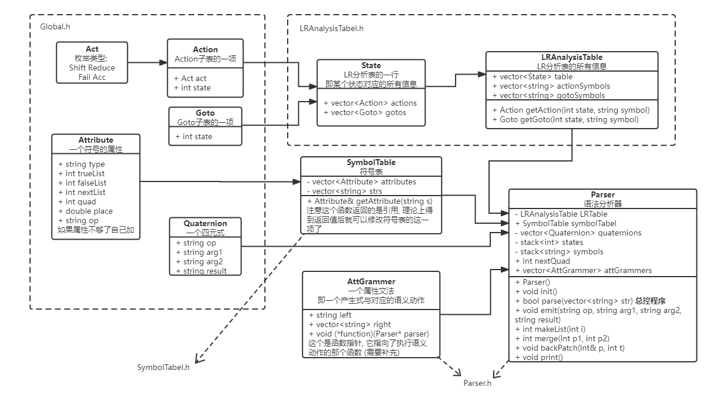
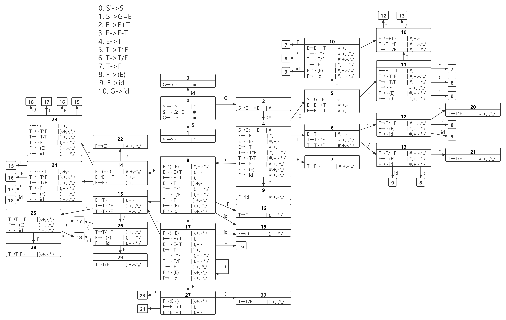
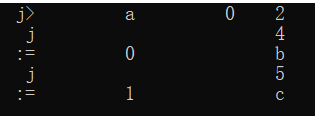
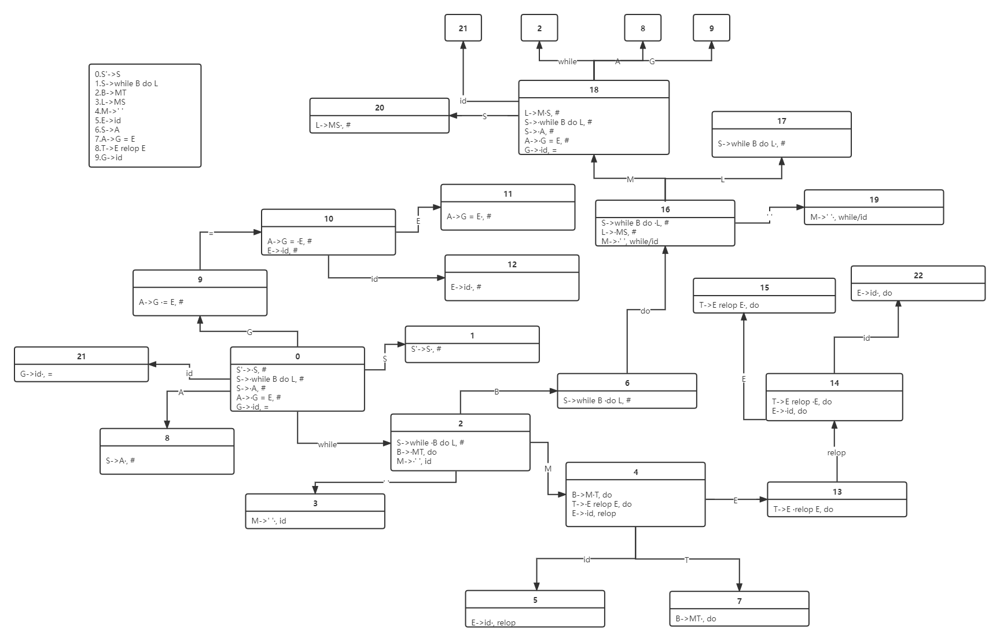
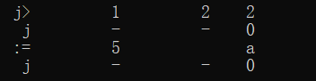
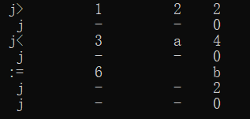

# 编译原理实验项目——中间代码生成

## 实验目的

- 深入了解LR(1)文法，LR分析表生成过程以及语法分析过程。
- 了解并实践每一种语句的中间代码生成过程。

## 实验环境

- 编程语言：C++
- IDE：Visual Studio 2019 / 2022
- 实验平台：Window 10 / 11

## 整体框架

### 项目文件结构

- Global.h：定义符号的属性(Attribute)，动作(Action/Goto)，四元式(Quaternion)，以及一些工具函数等。
- LRAnalysisTable.h：定义了**LR分析表(**LRAnalysisTable)。
- SymbolTable.h：定义了**符号表**(SymbolTable)和**属性文法**(AttGrammer)。
- Parser.h：定义了**分析器**(Parser)，其中关键的函数为`Parser::parse(std::vector<std::string>)`，定义了**LR语法分析函数**。
- main.cpp：定义了属性文法的**产生式**以及所有的**语义函数**。

### 类设计

#### 类图



#### 关键类详述

##### LR分析表

`State`类定义了LR分析表中某个状态的所有信息，即**LR分析表中的一行**。成员属性只有两个vector，分别是`vector<Action>`和`vector<Goto>`，对应了此状态下**Action子表**和**Goto子表**的信息。`Action`类对应着Action子表中一小格的信息，包含`Act`动作类型(Shift, Reduce, Acc和Fail)，以及移进的状态或规约所用的产生式。

`LRAnalysisTable`类定义了一个完整的LR分析表，包含了表中的所有的信息`vector<State>`(vector中第i个`State`即对应着LR分析表的第i行信息)，以及表头信息`actionSymbols`和`gotoSymbols`，对应着LR分析表表头的**终结符**和**非终结符**的符号。两个成员函数`getAction()`和`getGoto()`的功能是得到LR分析表中某状态某终结符对应的Action信息或非终结符对应的Goto信息。

```c++
// Global.h
enum class Act { // Action种类
	Shift, Reduce, Acc, Fail // 移进, 规约, 接受, 出错
};

class Action { // LR表中的Action项
public:
	Act act;
	int state;

	Action(const Act& _act = Act::Fail, const int& _state = -1) : act(_act), state(_state) { }
};

class Goto { // LR表中的Goto项
public:
	int state;

	Goto(const int& _state = -1) : state(_state) { }
};

// LRAnalysisTable.h
class State {
public:
	vector<Action> actions;
	vector<Goto> gotos;
};

class LRAnalysisTable {
public:
	vector<State> table;
	vector<string> actionSymbols;
	vector<string> gotoSymbols;

	LRAnalysisTable();

	Action getAction(const int& state, const string& symbol);
	Goto getGoto(const int& state, const string& symbol);
};
```

##### 属性文法

`AttGrammer`类定义了属性文法中的某一条**产生式**，`left`为产生式左部符号，`right`为产生式右部符号数组(vector)，`function`为此产生式对应的语义动作函数，形式上是一个参数为`Parser`类，返回值为`bool`的**函数指针**。

```c++
// Parser.h
class AttGrammer { // 属性文法
public:
	string left;
	vector<string> right;
	bool (*function)(Parser* parser); // 语义动作 (函数指针)

	AttGrammer() : function(nullptr) { }
	AttGrammer(const string& _left, const vector<string>& _right, bool (*f)(Parser* parser) = nullptr) 
        : left(_left), right(_right), function(f) { }
};
```

##### 分析器

`Parser`类是本项目最核心的类，其成员属性包含了LR分析表`LRAnalysisTable`，所有产生的四元式`vector<Quaternion>`，属性文法的所有产生式的信息`vector<AttGrammer>`，符号表`SymbolTable`以及分析过程中所用到的**状态栈**和**符号栈**。其成员函数则包括了属性文法中所有语义动作需要用到的函数，比如`makeList()`，`emit()`，`merge()`，`backPatch()`和`getNewTemp()`，以及**LR语法分析函数**`parse()`。

```c++
// Parser.h
class Parser {
private:
	LRAnalysisTable LRTable; // LR分析表
	vector<Quaternion> quaternions; // 四元式

	stack<int> states; // 状态栈
	stack<string> symbols; // 符号栈

	int tempId, terminalId;

public:
	int nextQuad; // 下一条四元式的标号
	vector<AttGrammer> attGrammers; // 属性文法
	SymbolTable symbolTabel; // 符号表

	Parser();

	void init();
	bool parse(const vector<string>& str);

	void emit(const string& op, const string& arg1, const string& arg2, const string& result); // 产生四元式
	int makeList(const int& i); // makeList
	int merge(const int& p1, const int& p2); // merge
	void backPatch(const int& p, const int& t); // 回填
	void print(); // 输出四元式
	string getNewTemp(); // 得到一个中间变量
};
```

#### 语法分析函数

```c++
bool Parser::parse(const vector<string>& str) {
	states.push(0);
	symbols.push("#");
	int p = 0; // 字符串指针
	bool fail = false, accept = false;
	while (1) {
		int s = states.top();
		string symbol = str[p];
		Action action;
		if (isNumber(symbol)) { // 判断symbol是否为数字
			Attribute& terminal = symbolTabel.getAttribute("id");
			terminal.place = symbol;
			terminal.type = string("Number");
			action = LRTable.getAction(s, string("id"));
		}
		else if (isBool(symbol)) { // 判断symbol是否为布尔型
			...
		}
		else if (ifVariable(symbol)) { // 判断symbol是否为合法变量
			...
		}
		else if (ifRelop(symbol)) { // 判断symbol是否为relop
			...
		}
		else action = LRTable.getAction(s, symbol); // 匹配其他关键字

		switch (action.act)
		{
			case Act::Shift: { // 移进
				states.push(action.state);
				symbols.push(symbol);
				p++; // 指向下一个字符
				break;
			}
			case Act::Reduce: { // 规约
				AttGrammer grammer = attGrammers[action.state]; // 对应属性文法
				if (grammer.function) {
					if (grammer.function(this)) { } // 执行对应语义动作
					else fail = true;
				}
				for (int i = 0; i < grammer.right.size(); i++) {
					states.pop();
					symbols.pop();
				}
				int nextState = LRTable.getGoto(states.top(), grammer.left).state;
				if (nextState < 0) { // 规约状态不存在, 出错
					fail = true;
					break;
				}
				else {
					states.push(nextState);
					symbols.push(grammer.left);
					break;
				}
			}
			case Act::Acc: { // 接受
				accept = true;
				break;
			}
			case Act::Fail: { // 出错
				fail = true;
				break;
			}
			default: {
				fail = true;
				break;
			}
		}
		if (fail) return false;
		if (accept) return true;
	}
}
```

#### 输入输出

LR分析表输入：一个名为`LRAnalysisTable.csv`的文件，示例如下：


中间代码输出：控制台，示例如下：


## 赋值语句

### 产生式

0. $$S'\rightarrow S   $$

1. $$S\rightarrow G=E $$

2. $$E\rightarrow E+T $$

3. $$E\rightarrow E-T  $$

4. $$E\rightarrow T   $$

5. $$T\rightarrow T*F  $$

6. $$T\rightarrow T/F  $$

7. $$T\rightarrow F   $$

8. $$F\rightarrow (E)  $$

9. $$F\rightarrow id  $$

10. $$G\rightarrow id $$

### DFA



### LR分析表

|      | #    | （   | ）   | *    | +    | -    | /    | =    | id   | E    | F    | G    | S    | T    |
| ---- | ---- | ---- | ---- | ---- | ---- | ---- | ---- | ---- | ---- | ---- | ---- | ---- | ---- | ---- |
| 0    |      |      |      |      |      |      |      |      | s3   |      |      | 2    | 1    |      |
| 1    | acc  |      |      |      |      |      |      |      |      |      |      |      |      |      |
| 2    |      |      |      |      |      |      |      | s4   |      |      |      |      |      |      |
| 3    |      |      |      |      |      |      |      | r10  |      |      |      |      |      |      |
| 4    |      | s8   |      |      |      |      |      |      | s9   | 5    | 7    |      |      | 6    |
| 5    | r1   |      |      |      | s10  | s11  |      |      |      |      |      |      |      |      |
| 6    | r4   |      | r4   | s12  | r4   | r4   | s13  |      |      |      |      |      |      |      |
| 7    | r7   |      | r7   | r7   | r7   | r7   | r7   |      |      |      |      |      |      |      |
| 8    |      | s8   |      |      |      |      |      |      | s9   | 14   | 7    |      |      | 6    |
| 9    | r9   |      | r9   | r9   | r9   | r9   | r9   |      |      |      |      |      |      |      |
| 10   |      | s8   |      |      |      |      |      |      | s9   |      | 7    |      |      | 15   |
| 11   |      | s8   |      |      |      |      |      |      | s9   |      | 7    |      |      | 16   |
| 12   |      | s8   |      |      |      |      |      |      | s9   |      | 17   |      |      |      |
| 13   |      | s8   |      |      |      |      |      |      | s9   |      | 18   |      |      |      |
| 14   |      |      | s19  |      | s10  | s11  |      |      |      |      |      |      |      |      |
| 15   | r2   |      | r2   | s12  | r2   | r2   | s13  |      |      |      |      |      |      |      |
| 16   | r3   |      | r3   | s12  | r3   | r3   | s13  |      |      |      |      |      |      |      |
| 17   | r5   |      | r5   | r5   | r5   | r5   | r5   |      |      |      |      |      |      |      |
| 18   | r6   |      | r6   | r6   | r6   | r6   | r6   |      |      |      |      |      |      |      |
| 19   | r8   |      | r8   | r8   | r8   | r8   | r8   |      |      |      |      |      |      |      |

### 部分产生式语义动作

$$S\rightarrow G=E$$

```c++
bool attGrammer2func(Parser* parser) { 
	Attribute& attributeOfG = parser->symbolTabel.getAttribute("G"); // 得到T的所有属性
	Attribute& attributeOfE = parser->symbolTabel.getAttribute(E()); // 得到E的所有属性
	Eid--;
	parser->emit(":=", attributeOfE.place, " ", attributeOfG.place);
	return true;
}
```

$$E\rightarrow E+T$$

```c++
bool attGrammer3func(Parser* parser) { 
	Attribute& attributeOfE = parser->symbolTabel.getAttribute(E()); // 得到E的所有属性
	Attribute& attributeOfT = parser->symbolTabel.getAttribute(T()); // 得到T的所有属性
	Tid--;
	string newTemp = parser->getNewTemp();
	parser->emit("+", attributeOfE.place, attributeOfT.place, newTemp);
	attributeOfE.place = newTemp;// E.place := newtemp;
	return true;
}
```

$$ T\rightarrow T/F$$

```c++
bool attGrammer7func(Parser* parser) {
	Attribute& attributeOfT = parser->symbolTabel.getAttribute(T()); // 得到T的所有属性
	Attribute& attributeOfF = parser->symbolTabel.getAttribute(F()); // 得到F的所有属性
	if (attributeOfF.place == "0")  // 直接除以0错误
		return false;
	Fid--;
	string newTemp = parser->getNewTemp();
	parser->emit("/", attributeOfT.place, attributeOfF.place, newTemp);
	attributeOfT.place = newTemp;// T.place := newtemp;
	return true;
}
```

$$ G\rightarrow id$$

```c++
bool attGrammer11func(Parser* parser) {
	Attribute& attributeOfG = parser->symbolTabel.getAttribute("G"); // 得到F的所有属性
	Attribute& attributeOfId = parser->symbolTabel.getAttribute("id"); // 得到Number的所有属性
	if (attributeOfId.type != "Variable") return false; // G不是变量, 出错
	attributeOfG.place = attributeOfId.place;
	return true;
}
```

### 输入输出示例

输入语句：

```
a = 1.3 * ( -2.2 + 3 / 5 ) #
```

输出结果：


## 布尔表达式
### 产生式

1.$$B'->B$$

2.$$B->B \&\&T$$

3.$$B->T$$

4.$$T->T||F$$

5.$$T->F$$

6.$$F->!F$$

7.$$F->true$$

8.$$F->false$$

9.$$F->i\ rop\ i$$

### LR分析表

|      | &&   | \|\| | !    | true | false | (    | )    | i    | rop  | #    | B    | T    | F    |
| ---- | ---- | ---- | ---- | ---- | ----- | ---- | ---- | ---- | ---- | ---- | ---- | ---- | ---- |
| 0    |      |      | s_4  | s_5  | s_6   | s_7  |      | s_8  |      |      | 1    | 2    | 3    |
| 1    | s_9  |      |      |      |       |      | r_2  |      |      | acc  |      |      |      |
| 2    | r_2  | s_10 |      |      |       |      | r_2  |      |      | r_2  |      |      |      |
| 3    | r_4  | r_4  |      |      |       |      | r_4  |      |      | r_4  |      |      |      |
| 4    |      |      | s_4  | s_5  | s_6   | s_7  |      | s_8  |      |      |      |      | 11   |
| 5    | r_7  | r_7  |      |      |       |      | r_7  |      |      | r_7  |      |      |      |
| 6    | r_8  | r_8  |      |      |       |      | r_8  |      |      | r_8  |      |      |      |
| 7    |      |      | s_4  | s_5  | s_6   | s_7  |      | s_8  |      |      | 12   | 2    | 3    |
| 8    |      |      |      |      |       |      |      |      | s_13 |      |      |      |      |
| 9    |      |      | s_4  | s_5  | s_6   | s_7  |      | s_8  |      |      |      | 14   | 3    |
| 10   |      |      | s_4  | s_5  | s_6   | s_7  |      | s_8  |      |      |      |      | 15   |
| 11   | r_5  | r_5  |      |      |       |      | r_5  |      |      | r_5  |      |      |      |
| 12   | s_9  |      |      |      |       |      | s_16 |      |      |      |      |      |      |
| 13   |      |      |      |      | r_3   |      |      | s_17 |      |      |      |      |      |
| 14   | r_1  | s_10 |      |      |       |      | r_1  |      |      | r_1  |      |      |      |
| 15   | r_3  | r_3  |      |      |       |      | r_3  |      |      | r_3  |      |      |      |
| 16   | r_6  | r_6  |      |      |       |      | r_6  |      |      | r_6  |      |      |      |
| 17   | r_9  | r_9  |      |      |       |      | r_9  |      |      | r_9  |      |      |      |

### 输入输出示例

输入语句：

```
true && false || ( i > i ) #
```

## 条件语句
### 

0. $$E'\rightarrow E   $$
1. $$E\rightarrow if\ T\ then\ H $$
2. $$E\rightarrow if\ T\ then\ H_1\ else \ H_2$$
3. $$T\rightarrow F_1\ relop\ F_2  $$
4. $$F\rightarrow id   $$
5. $$H\rightarrow G=F  $$
6. $$G\rightarrow id $$

### DFA


### LR分析表

|      | #    | if   | then | else | relop | id   | =    | E    | T    | F    | H    | G    |
| ---- | ---- | ---- | ---- | ---- | ----- | ---- | ---- | ---- | ---- | ---- | ---- | ---- |
| 0    |      | s_2  |      |      |       |      |      | 1    |      |      |      |      |
| 1    | acc  |      |      |      |       |      |      |      |      |      |      |      |
| 2    |      |      |      |      |       | s_3  |      |      | 5    | 6    |      |      |
| 3    |      |      |      |      | r_4   |      |      |      |      |      |      |      |
| 4    |      |      | r_4  |      |       |      |      |      |      |      |      |      |
| 5    |      |      | s_9  |      |       |      |      |      |      |      |      |      |
| 6    |      |      |      |      | s_7   |      |      |      |      |      |      |      |
| 7    |      |      |      |      |       | s_4  |      |      |      | 8    |      |      |
| 8    |      |      | r_3  |      |       |      |      |      |      |      |      |      |
| 9    |      |      |      |      |       | s_21 |      |      |      |      | 10   | 17   |
| 10   | r_1  |      |      | s_11 |       |      |      |      |      |      |      |      |
| 11   |      |      |      |      |       | s_21 |      |      |      |      | 12   | 13   |
| 12   | r_2  |      |      |      |       |      |      |      |      |      |      |      |
| 13   |      |      |      |      |       |      | s_14 |      |      |      |      |      |
| 14   |      |      |      |      |       | s_16 |      |      |      | 15   |      |      |
| 15   | r_5  |      |      |      |       |      |      |      |      |      |      | 23   |
| 16   | r_4  |      |      |      |       |      |      |      |      |      |      |      |
| 17   |      |      |      |      |       |      | s_18 |      |      |      |      |      |
| 18   |      |      |      |      |       | s_19 |      |      |      | 20   |      |      |
| 19   | r_4  |      |      | r_4  |       |      |      |      |      |      |      |      |
| 20   | r_5  |      |      | r_5  |       |      |      |      |      |      |      |      |
| 21   |      |      |      |      |       |      | r_6  |      |      |      |      |      |

### 部分产生式语义动作

$$E\rightarrow if\ T\ then\ H_1\ else \ H_2$$

```c++
bool attGrammer3func(Parser* parser) { 
	Attribute& attributeOfM2 = parser->symbolTabel.getAttribute(M());
	Mid--;
	Attribute& attributeOfM1 = parser->symbolTabel.getAttribute(M());
	Mid--;
	Eid++;
	Attribute& attributeOfE = parser->symbolTabel.getAttribute(E()); // 得到E的所有属性
	Attribute& attributeOfT = parser->symbolTabel.getAttribute(T()); // 得到T的所有属性
	Tid--;
	Attribute& attributeOfH2 = parser->symbolTabel.getAttribute(H()); // 得到E的所有属性
	Hid--;
	Attribute& attributeOfH1 = parser->symbolTabel.getAttribute(H()); // 得到E的所有属性
	Hid--;
	parser->backPatch(attributeOfT.trueList, attributeOfM1.quad);
	parser->backPatch(attributeOfT.falseList, attributeOfM2.quad);
	std:cout << "test:" << attributeOfH1.nextList << endl;
	Nid--;
	Attribute& attributeOfN = parser->symbolTabel.getAttribute(N()); // 得到N的所有属性
	Nid--;
	attributeOfE.nextList = attributeOfN.nextList;
	parser->pop();
	parser->backPatch(attributeOfE.nextList, parser->nextQuad);
	return true;
}
```

$$T\rightarrow F_1\ relop\ F_2  $$

```c++
bool attGrammer4func(Parser* parser) { 
	Tid++;
	Attribute& attributeOfT = parser->symbolTabel.getAttribute(T()); // 得到T的所有属性
	Attribute& attributeOfRelop = parser->symbolTabel.getAttribute("relop"); // 得到Relop的所有属性
	Attribute& attributeOfF2 = parser->symbolTabel.getAttribute(F()); // 得到E的所有属性
	Fid--;
	Attribute& attributeOfF1 = parser->symbolTabel.getAttribute(F()); // 得到T的所有属性
	Fid--;
	attributeOfT.trueList = parser->makeList(parser->nextQuad);
	attributeOfT.falseList = parser->makeList(parser->nextQuad + 1);
	parser->emit("j" + attributeOfRelop.op, attributeOfF1.place, attributeOfF2.place, "0");
	parser->emit("j"," "," ","0");

	return true;
}
```


### 输入输出示例

输入语句：

```
if a>0 then b=0 else =1
```

输出结果：


## 循环语句

### 产生式

0. $$S'\rightarrow S   $$

1. $$S\rightarrow while\ B\ do\ L   $$
2. $$B\rightarrow MT   $$
3. $$L\rightarrow MS   $$
4. $$M\rightarrow '\ '   $$
5. $$E\rightarrow id   $$
6. $$S\rightarrow A   $$
7. $$A\rightarrow G=E   $$
8. $$T\rightarrow E\ relop\ E   $$
9. $$G\rightarrow id   $$

### DFA



### LR分析表

|      | #    | while | do   |      | id   | =    | relop | S    | B    | L    | M    | T    | E    | A    | G    |
| ---- | ---- | ----- | ---- | ---- | ---- | ---- | ----- | ---- | ---- | ---- | ---- | ---- | ---- | ---- | ---- |
| 0    |      | s_2   |      |      | s_21 |      |       | 1    |      |      |      |      |      | 8    | 9    |
| 1    | acc  |       |      |      |      |      |       |      |      |      |      |      |      |      |      |
| 2    |      |       |      | s_3  |      |      |       |      | 6    |      | 4    |      |      |      |      |
| 3    |      |       |      |      | r_4  |      |       |      |      |      |      |      |      |      |      |
| 4    |      |       |      |      | s_5  |      |       |      |      |      |      | 7    | 13   |      |      |
| 5    |      |       |      |      |      |      | r_5   |      |      |      |      |      |      |      |      |
| 6    |      |       | s_16 |      |      |      |       |      |      |      |      |      |      |      |      |
| 7    |      |       | r_2  |      |      |      |       |      |      |      |      |      |      |      |      |
| 8    | r_6  |       |      |      |      |      |       |      |      |      |      |      |      |      |      |
| 9    |      |       |      |      |      | s_10 |       |      |      |      |      |      |      |      |      |
| 10   |      |       |      |      | s_12 |      |       |      |      |      |      |      | 11   |      |      |
| 11   | r_7  |       |      |      |      |      |       |      |      |      |      |      |      |      |      |
| 12   | r_5  |       |      |      |      |      |       |      |      |      |      |      |      |      |      |
| 13   |      |       |      |      |      |      | s_14  |      |      |      |      |      |      |      |      |
| 14   |      |       |      |      | s_22 |      |       |      |      |      |      |      | 15   |      |      |
| 15   |      |       | r_8  |      |      |      |       |      |      |      |      |      |      |      |      |
| 16   |      |       |      | s_19 |      |      |       |      |      | 17   | 18   |      |      |      |      |
| 17   | r_1  |       |      |      |      |      |       |      |      |      |      |      |      |      |      |
| 18   |      | s_2   |      |      | s_21 |      |       | 20   |      |      |      |      |      | 8    | 9    |
| 19   |      | r_4   |      |      | r_4  |      |       |      |      |      |      |      |      |      |      |
| 20   | r_3  |       |      |      |      |      |       |      |      |      |      |      |      |      |      |
| 21   |      |       |      |      |      | r_9  |       |      |      |      |      |      |      |      |      |
| 22   |      |       | r_5  |      |      |      |       |      |      |      |      |      |      |      |      |

### 部分产生式语义动作

$$S\rightarrow while\ B\ do\ L   $$

```c++
bool attGrammer1func(Parser* parser) { 
	Sid++;
	Attribute& attributeOfS = parser->symbolTabel.getAttribute(S());
	Attribute& attributeOfB = parser->symbolTabel.getAttribute(B());
	Attribute& attributeOfL = parser->symbolTabel.getAttribute(L());
	if (attributeOfL.nextList != -1) {
		parser->backPatch(attributeOfL.nextList, attributeOfB.quad);
	}
	
	parser->backPatch(attributeOfB.trueList, attributeOfL.quad);
	parser->emit("j", "-", "-", std::to_string(attributeOfB.quad));
	Bid--;
	Lid--;
	return true;
}
```

$$B\rightarrow MT   $$

```c++
bool attGrammer2func(Parser* parser) { 
	Bid++;
	Attribute& attributeOfB = parser->symbolTabel.getAttribute(B()); 
	Attribute& attributeOfM = parser->symbolTabel.getAttribute(M()); 
	Attribute& attributeOfT = parser->symbolTabel.getAttribute(T());
	attributeOfB.quad = attributeOfM.quad;
	attributeOfB.trueList = attributeOfT.trueList;
	Mid--;
	Tid--;
	return true;
}
```

$$L\rightarrow MS   $$

```c++
bool attGrammer3func(Parser* parser) { 
	Lid++;
	Attribute& attributeOfL = parser->symbolTabel.getAttribute(L());
	Attribute& attributeOfM = parser->symbolTabel.getAttribute(M()); 
	Attribute& attributeOfS = parser->symbolTabel.getAttribute(S());
	attributeOfL.quad = attributeOfM.quad;
	attributeOfL.nextList = attributeOfS.nextList;
	Mid--;
	Sid--;
	return true;
}
```

$$M\rightarrow '\ '   $$

```c++
bool attGrammer4func(Parser* parser) {
	Mid++;
	Attribute& attributeOfM = parser->symbolTabel.getAttribute(M()); 
	attributeOfM.quad = parser->nextQuad;
	return true;
}
```

$$A\rightarrow G=E   $$

```c++
bool attGrammer7func(Parser* parser) {
	Aid++;
	Attribute& attributeOfG = parser->symbolTabel.getAttribute(G()); 
	Attribute& attributeOfE = parser->symbolTabel.getAttribute(E()); 
	parser->emit(":=", attributeOfE.place, " ", attributeOfG.place);
	Gid--;
	Eid--;
	return true;
}
```

$$T\rightarrow E\ relop\ E   $$

```c++
bool attGrammer8func(Parser* parser) {
	Tid++;
	Attribute& attributeOfT = parser->symbolTabel.getAttribute(T()); 
	Attribute& attributeOfE2 = parser->symbolTabel.getAttribute(E());
	Eid--;
	Attribute& attributeOfE1 = parser->symbolTabel.getAttribute(E());
	Attribute& attributeOfrelop = parser->symbolTabel.getAttribute("relop");
	attributeOfT.trueList = parser->makeList(parser->nextQuad);
	attributeOfT.falseList = parser->makeList(parser->nextQuad + 1);
	string a = attributeOfrelop.op;
	string b = "j";
	b = b + a;
	parser->emit(b, attributeOfE1.place, attributeOfE2.place, "0");
	parser->emit("j", "-", "-", "0");
	return true;
}

```

### 输入输出示例

输入语句：

```
while  1 > 2 do  a = 5
```

输出结果：

输入语句：

```
while  1 > 2 do  while  3 < a do  b = 6
```

输出结果：


## 实验小结

项目亮点：

1. 自己实现了LR分析器的框架。
2. 扩充了产生式，使其支持运算优先级。
